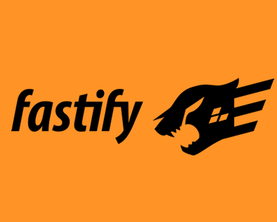

<!-- Improved compatibility of back to top link: See: https://github.com/othneildrew/Best-README-Template/pull/73 -->

<!-- PROJECT LOGO -->
 

  

  <h3 align="center">NODE API REST SQLITE</h3>

  

    An full api rest build with NodeJS / Fastify and Vitest for Test
     
    <a href="mailto:yuutoandrew.jpn@gmail.com">Report Bug</a>
  

<!-- ABOUT THE PROJECT -->
## About The Project

[![Product Name Screen Shot][product-screenshot]](https://devandrew.com.br)

Api REST developed with node in typescript, using fastify, knex to vitest for e2e testing

### Built With

* [![NodeJS][Node.js]][Node-url]
* [![Fastify][Fastify.]][Fastify-url]

<!-- CONTACT -->
## Contact

Andrew Augusto - [@Linkedin](https://www.linkedin.com/in/andrew-oliveira-734b191b1/) - Andrew Oliveira

(<a href="#readme-top">back to top</a>)

<!-- ACKNOWLEDGMENTS -->
## Acknowledgments

Some plus libs that i use in!

* [Knex](https://knexjs.org/) - For SQLITE Connections and migrations
* [Vitest](https://vitest.dev/) - For Testing

<!-- MARKDOWN LINKS & IMAGES -->
[product-screenshot]: code_print.png
[Node.js]: https://img.shields.io/badge/node.js-6DA55F?style=for-the-badge&logo=node.js&logoColor=white
[Node-url]: https://nodejs.org/en
[Fastify.]: https://img.shields.io/badge/fastify-%23000000.svg?style=for-the-badge&logo=fastify&logoColor=white
[Fastify-url]: https://fastify.dev/